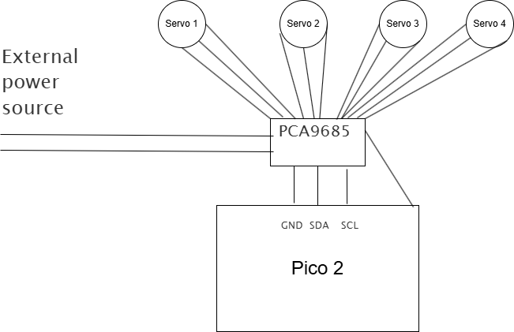

# Robotic Arm

Robotic arm is a  project about making my own robotic arm from scratch. I designed the arm from scratch and i plan to 3D print the file. Both firmware codes are written by me. The C++ code will run on  microcontroller, i will be using pico 2. The python code can be run on any computer wich can run python files. 

## Operation
First assemble the arm and try to set the servos in 90 degrees position. Then compile the code and wire everything together. After that run the python code and connnect the microcontroller via usb to your computer. Then use the python code to operate it, send signals, set position and record position. I plan on to make more function, but i only have this for now, because i dont have the arm physically so i cannot test it. Use buttons to record andgles or save load or play animations. Use sliders to set the values

## Circuit
The circuit consists of a microcontroller, can be any but i chose pico 2. A PCA9685 servo driver servos, and a exteral power source. Just plug the servos into the driver and connect shared ground and sda and scl for data. You also need to power the microcontroller, for that u can use the 5v pin from the servo driver.

## Why?
Why would i want to build this arm? Because it is a great learning oppurtunity that can teach me many new things. It is also a challange for me, because it is one of my first big projects. I also need a small assistant to help me move things around my desk.

Made by Tomáš Straka for Statis Hackathon by hackclub.
