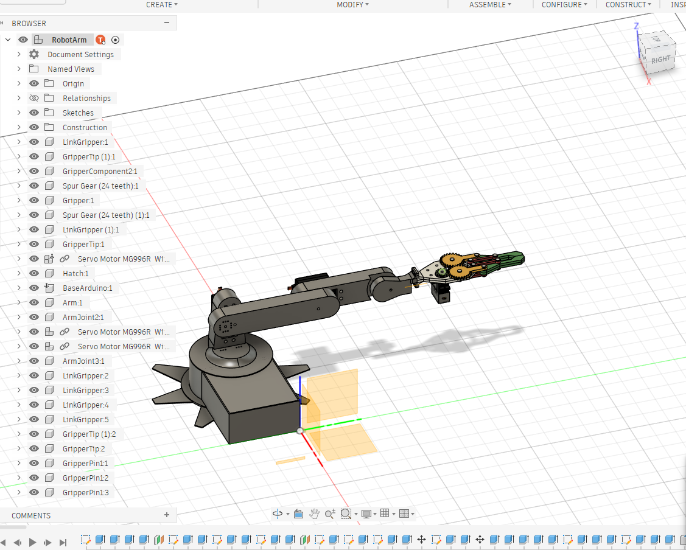
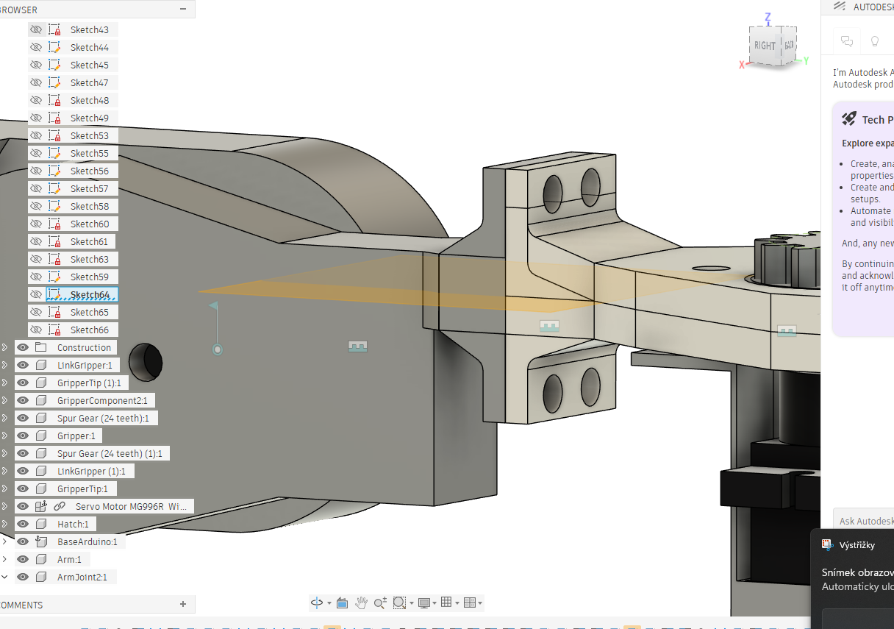
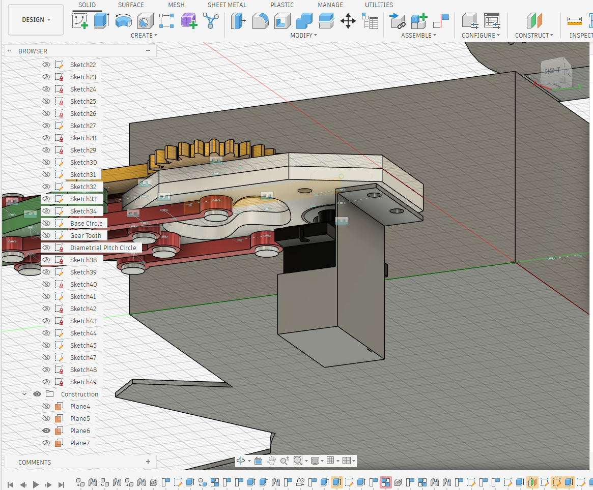
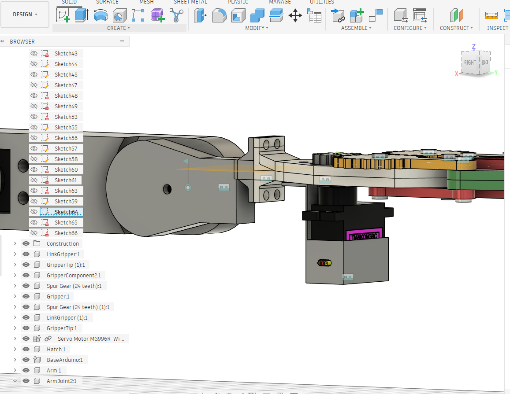
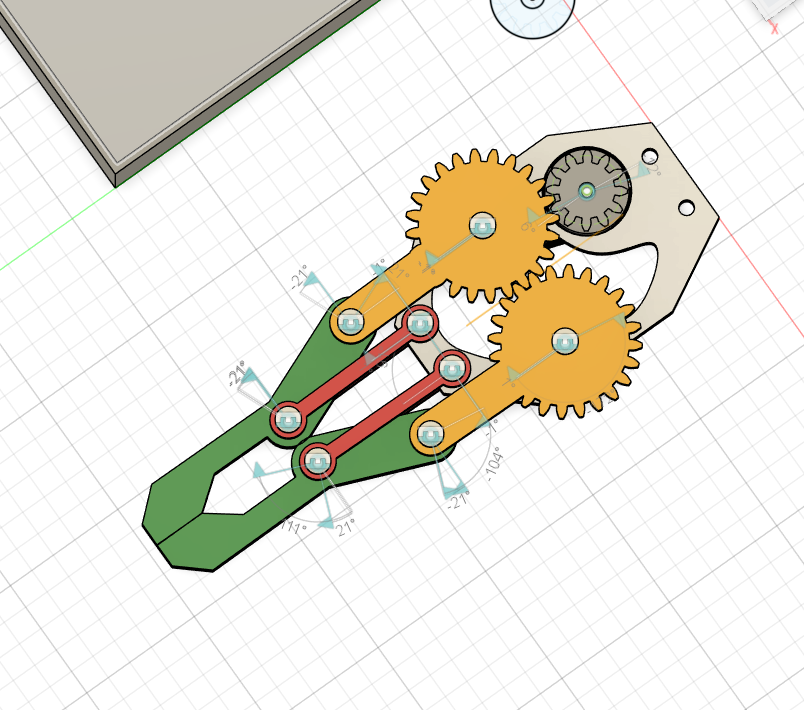
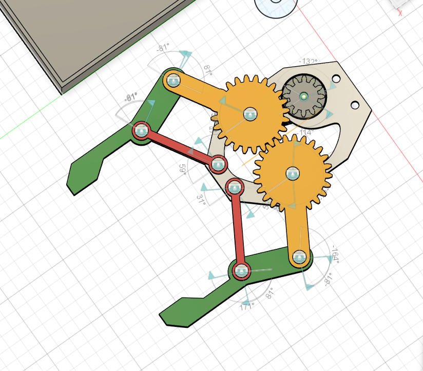

# Robotic Arm

Robotic arm is a  project about making my own robotic arm from scratch. I will design the arm in fusion 360 and 3D print it and then assemble it and program it by myself. I would like to add coordinate system to it using inverse kynematics and make it pick up objects.

Made by Tomáš Straka for Statis Hackathon by hackclub.

