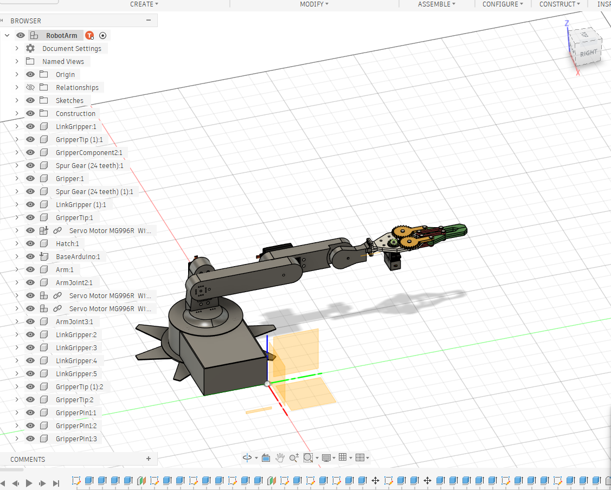
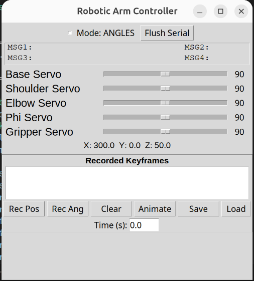
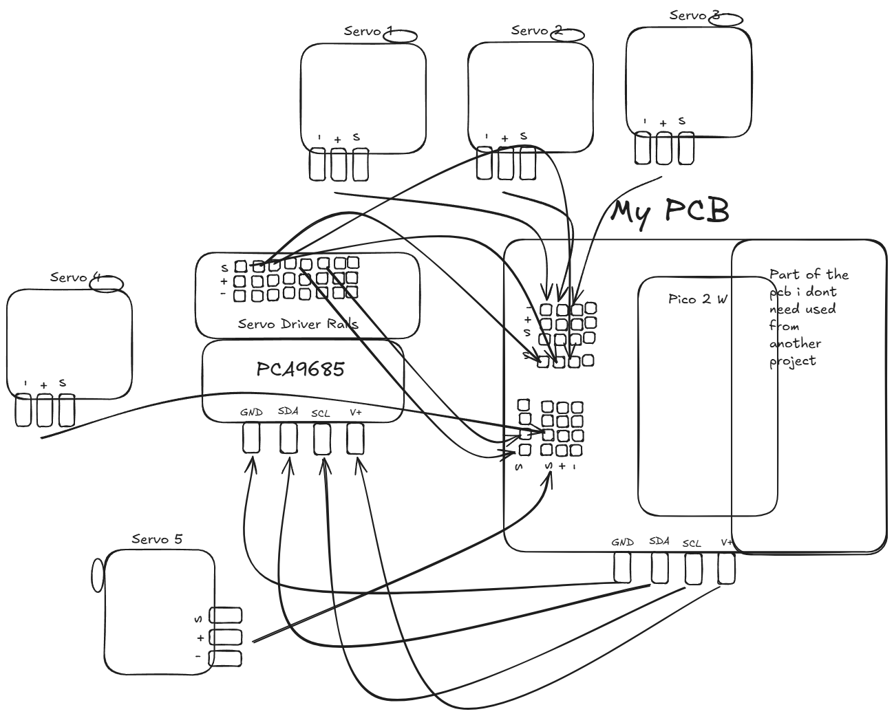
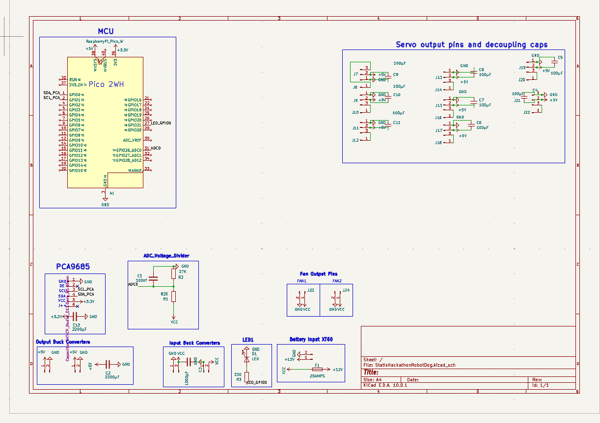
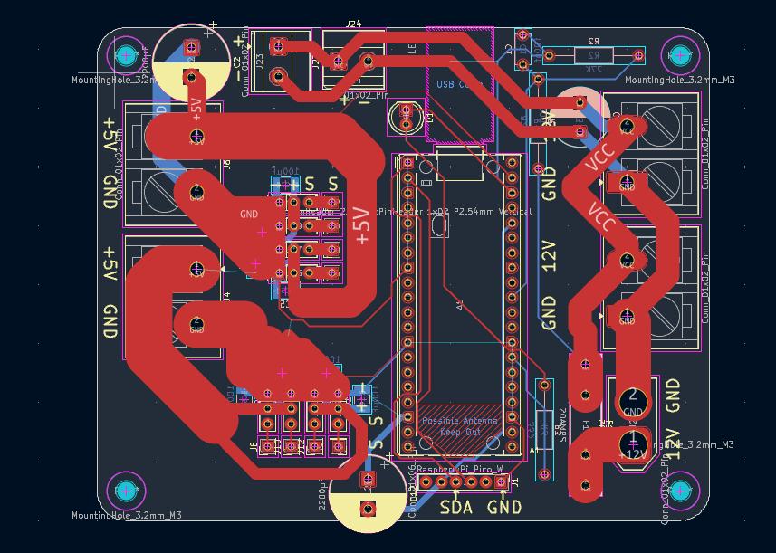
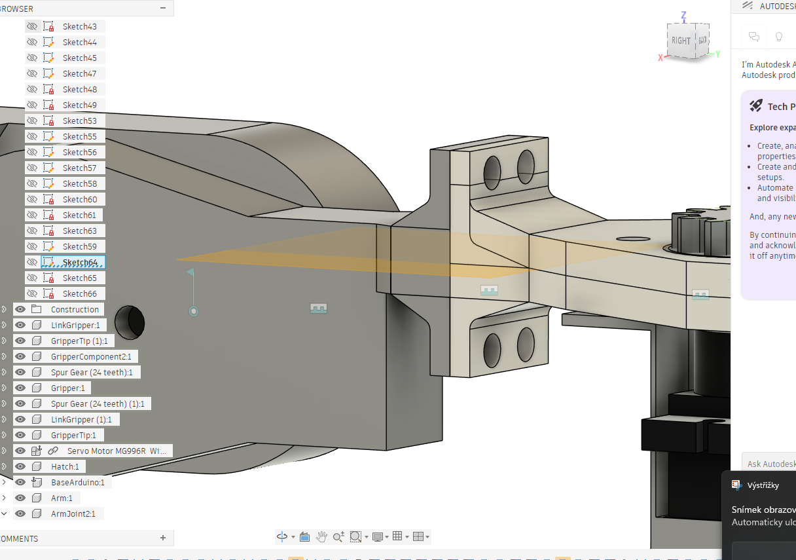
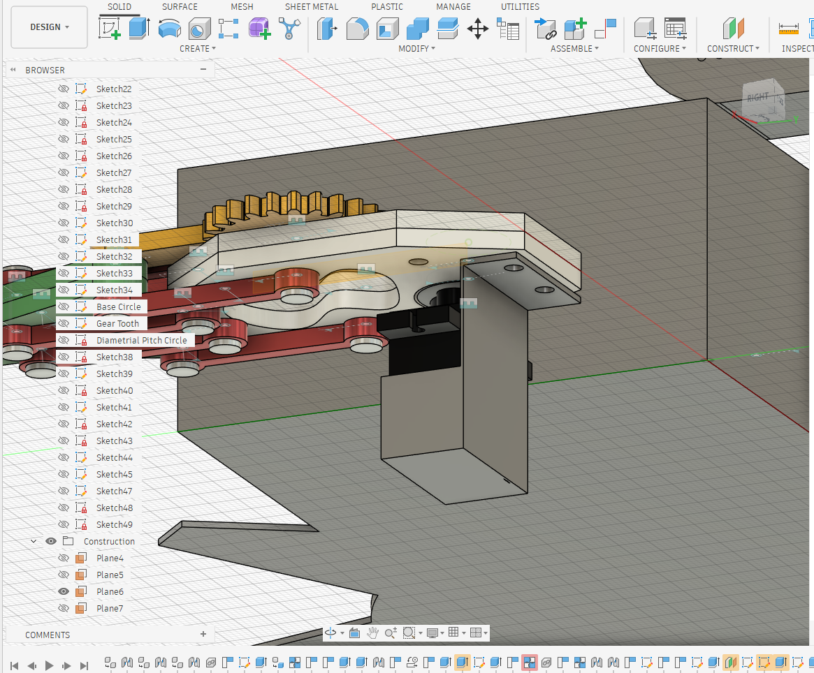
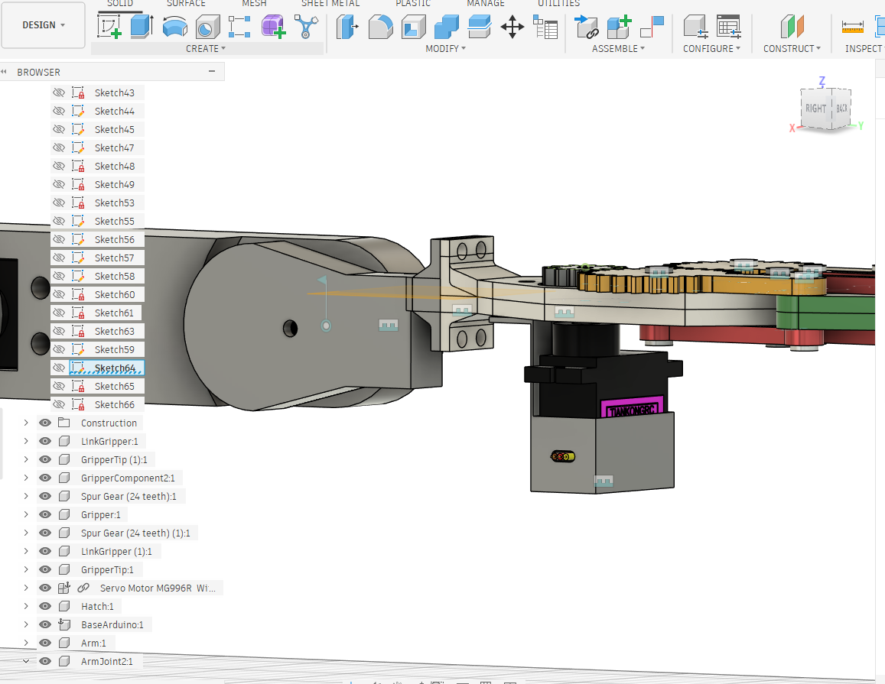
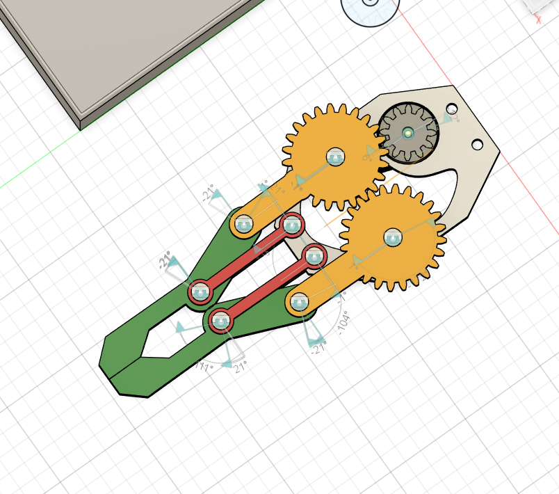
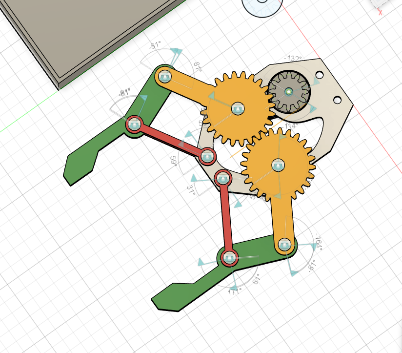

# Robotic Arm

Robotic arm is a  project about making my own robotic arm from scratch. I designed the arm from scratch and i plan to 3D print the file. Both firmware codes are written by me. The C++ code will run on  microcontroller, i will be using pico 2. The python code can be run on any computer wich can run python files. 

## Operation
First assemble the arm and try to set the servos in 90 degrees position. Then compile the code and wire everything together. After that run the python code and connnect the microcontroller via usb to your computer. Then use the python code to operate it, send signals, set position and record position. The main inverse and forward kinematics run on the pc, the c++ microcontroller code just recieves the serial commands. It uses cosine ease when animating through the listbox to make the movement seems smooth, moves nonlinearly.

### Keybinds
Use keybinds to control the robotic arm easily.
```
[t]: increments the time by 0.5 seconds
[q]: closes the serial port and GUI
[l]: loads animation
[s]: saves animation
[space]: animates smoothly through loaded positions or angles
[r]: records the current position onto the listbox
```

## What can it do?
You can set positions manually, record and play animations, pick up objects, use it to help you in your everyday life.


## Circuit
The circuit consists of a microcontroller, can be any but i chose pico 2. A PCA9685 servo driver servos, exteral power source and i pcb i will use from my other project. Connect servos to the pcb pins, and connect gnd to gnd and 5V to pcb 5V. Connect signal pins from pcb pins to PCA9685 signal pins. Connect sda scl and power pins from pico 2 to PCA9685. Then upload the code and turn on the power supply. The power supply should be able to handle around 5v 10 amps for safety. The pcb connects the microcontroller, has the adc voltage dividers, output pins for servos, etc. It connects everything together and makes it simplier. It also has some features i am not using like the fans or the adc, but are in the robotic dog project.





## How to print?
If you want to replicate the project, you need to buy simillar servos, use some i2c pwm generation module and some circuit to distribute the power. For printing downooad the 3d print file, and use a 3d printer, that has over 400mm print surface. I want to use pla, because it is cheap and okay for my project. You can use other filaments if you want. For my printer, Prusa XL, the slicer says that it would take 22 hours to print and 300 grams to print. Use any microcontroller wich has i2c and serial communication, upload the code and connect it via usb to pc running the python file. Then it should work.

## Why?
Why would i want to build this arm? Because it is a great learning oppurtunity that can teach me many new things. It is also a challange for me, because it is one of my first big projects. I also need a small assistant to help me move things around my desk.













### Bill of Materials (BOM)

| Name | Purpose | Quantity | Total Cost (USD) | Link | Distributor |
|:---|:---|:---:|:---:|:---|:---|
| Servo 30 cm connector cable extension Male - Female | Cable extension for servo so i can connect it to power and microcontroller when the cable is not long enough to reach it. | 2 | $4.68 | [Link](https://rpishop.cz/servomotory/2878-servo-30-cm-propojka-samec-samice.html) | rpishop.cz |
| Raspberry Pico 2 WH | It is the brain of the robotic arm, will be used to control the servos and if it works compute angles using inverse kynematic for the servos. | 1 | $10.98 | [Link](https://rpishop.cz/590613/raspberry-pico-2-wh/) | rpishop.cz |
| Professional Lab - PLA+ Filament - black(1,75 mm, 1 kg) | It is the filment i will use to print the robotic arm fusion 360 model | 1 | $10.80 | [Link](https://rpishop.cz/616058/professional-lab-pla-plus-cerny/) | rpishop.cz |
| Servo motor MG996R 13 kg, 180° | Motors of the arm, will rotate the joints | 3 | $18.60 | [Link](https://rpishop.cz/641352/servo-mg996r-13-kg/) | rpishop.cz |
| **Total** | | | **$45.06** | | |

Note: PCA9685 I2C driver and power supply were reused from previous projects / already owned, $0 cost.

Made by Tomáš Straka for Statis Hackathon by hackclub.
